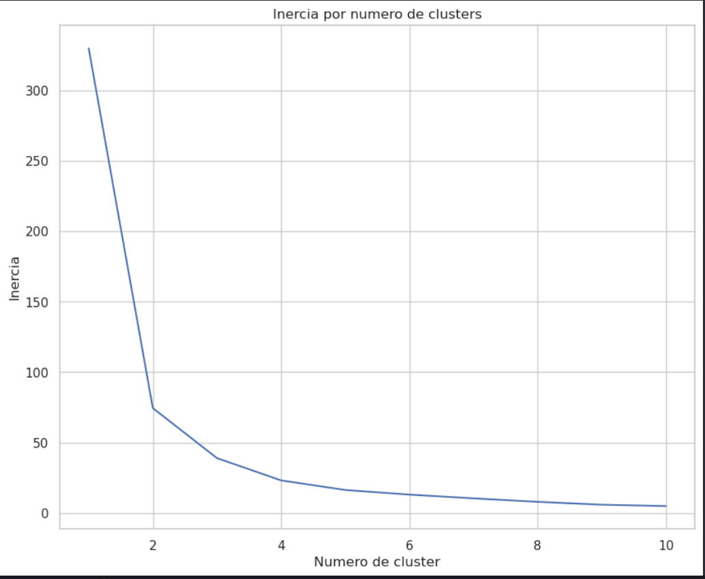

## RFV

A análise RFV pode ser uma peça crucial para a otimização dos lucros de uma empresa. Os clientes são classificados em relação a:

- **Recência:** Quanto tempo realizaram uma compra.
- **Frequência:** Com que frequência fazem compras.
- **Valor:** Quanto dinheiro gastam em cada compra.

Esse tipo de análise permite que empresas desenvolvam estratégias de marketing personalizado, otimizando ainda mais os lucros ao entender o comportamento de seus clientes. Um trabalho que pode ser realizado em conjunto com equipes de data science e marketing pode fazer com que o lucro de uma empresa cresça exponencialmente.

### Features do dataset

- **InvoiceNo:** Número único associado a cada fatura (transação) no conjunto de dados.

- **StockCode:** Código único associado a cada produto ou item em estoque.

- **Description:** Descrição do produto ou item correspondente ao StockCode.

- **Quantity:** A quantidade de unidades do produto ou item incluídas em uma transação.

- **InvoiceDate:** Data e horário em que a transação foi registrada.

- **UnitPrice:** Preço unitário de cada produto ou item.

- **CustomerID:** Identificador único associado a cada cliente.

- **Country:** País de origem do cliente ou local da transação.

# Análise Exploratória dos Dados
## Análise da Distribuição de Recência dos Clientes

O boxplot abaixo fornece uma análise da distribuição da recência dos clientes, revelando comportamentos importantes.

## Comportamentos Observados

- **Mediana e Média:**
  - A mediana da recência dos clientes, representada pela linha vermelha tracejada, está em torno de 2 meses.
  - A média de retorno dos clientes é de aproximadamente 3 meses, indicando que, em média, os clientes apresentam um ciclo de compra a cada 3 meses.

- **Tendência Central:**
  - A mediana fornece uma medida robusta da tendência central e sugere que a maioria dos clientes retorna em torno desse período de tempo.

## Conclusões Preliminares

O box plot descreve alguns comportamentos notáveis na recência dos clientes. A média sugerem que a maioria dos clientes tende a retornar em aproximadamente 3 meses. É possível identificar alguns outliers, representando clientes que não realizam compras há bastante tempo, apresentando uma alta recência. Para esse tipo de cliente, estratégias específicas podem ser consideradas, como campanhas direcionadas de reativação, lembretes personalizados, e até mesmo a implementação de um bot em aplicativos de mensagens para enviar esse tipo de lembrete, entre outras estratégias.

## Distribuição de Recência dos Clientes

Ao analisar o gráfico, é possível notar que a maioria dos clientes está há menos de 6 meses sem comprar. Isso indica que a empresa está mantendo um bom relacionamento com os clientes.

No entanto, há um número significativo de clientes que estão há mais de 6 meses sem comprar. Esses clientes podem estar insatisfeitos com a empresa ou podem ter encontrado opções melhores com preços mais acessíveis.

Esses dados podem ser úteis na criação de campanhas de marketing, especialmente para os clientes que estão há muito tempo sem comprar na empresa, evitando um possível churn.

## Análise da Melhor Quantidade de Clusters com o Método do Cotovelo

Ao avaliar o gráfico, observamos que a partir de 4 clusters, a melhora na inércia não é tão significativa, então irei usar 4 clusters.

## Análise de Recência por Cluster

**Cluster 0: Ativos e Engajados:**
O Cluster 0 apresenta a menor média de recência, indicando que os clientes desse grupo são valiosos para a empresa, pois tendem a comprar em intervalos curtos de tempo.

**Cluster 1: Necessidade de Reativação:**
Este cluster possui a maior média de recência, indicando clientes que precisam de atenção para possível reativação.

**Cluster 2: Clientes Leais e Frequentes:**
Com recência baixa, um pouco maior que o Cluster 0, esses clientes demonstram lealdade e frequência nas compras.

**Cluster 3: Recência Mediana:**
Clientes não tão frequentes, mas que tendem a retornar em intervalos de tempo mais longos.

## Análise de Frequência por Cluster

**Cluster 0: Maior Frequência:**
Assim como uma baixa recência, o Cluster 0 possui uma alta frequência, indicando que esse cluster contém os clientes mais importantes. É necessário manter esses clientes, pois possivelmente contribuem significativamente para os lucros da empresa.

**Cluster 1: Necessidade de Reativação:**
Possui alta recência e baixa frequência, indicando que o Cluster 1 possui os clientes menos engajados. É necessário entender os motivos por trás da baixa frequência e alta recência.

**Cluster 2: Clientes Leais:**
Possui a segunda maior frequência, não tão alta, mas indicando que no Cluster 2 existem clientes importantes. É possível adotar estratégias para aumentar a frequência.

**Cluster 3: Baixa Frequência:**
Frequência maior que a do Cluster 1, porém menor que a do Cluster 2. Estratégias para incentivar compras mais frequentes incluem ofertas de promoções, mensagens oferecendo produtos novos e a identificação dos itens que os clientes desse cluster tendem a comprar.

## Análise da Média de Valor Monetário por Cluster

**Cluster 0: Moderado em Valor Monetário**
Apesar de ter a menor recência média e a maior frequência, o gasto médio não é tão alto.

**Cluster 1: Maior Recência e Maior Gasto**
Apesar da maior recência média e menor frequência, este cluster é o que mais gasta. 

**Cluster 2: Moderado em Recência e Gasto**
Este cluster possui uma média equilibrada de recência e frequência, mas o gasto médio não é muito alto.

**Cluster 3: Menor Recência e Gasto**
Apesar de ter uma recência média menor e uma frequência intermediária, o gasto médio não é tão elevado.

# Conclusão e Possíveis Estratégias

A análise de cluster permitiu identificar quatro grupos de clientes com características distintas. As estratégias a seguir podem ser adotadas para melhorar a experiência desses clientes e aumentar a lucratividade da empresa:

## Cluster 0: "Frequentes, Recentes e Econômicos"

* **Características:** Maior frequência, menor recência, mas gasto médio baixo.
* **Possíveis Estratégias:**
    * Oferecer novos produtos que possam atrair interesse frequente.
    * Implementar um programa de fidelidade para recompensar a lealdade desses clientes.

## Cluster 1: "Esporádicos, Recentes e Valiosos"

* **Características:** Baixa frequência, alta recência, mas gasto elevado.
* **Possíveis Estratégias:**
    * Identificar padrões de compra para personalizar promoções.
    * Enviar mensagens com ofertas específicas com base nas tendências de compra.
    * Estratégias de marketing em datas comemorativas para oferecer produtos relevantes.

## Cluster 2: "Constantes e Moderados"

* **Características:** Recência baixa, frequência mediana.
* **Possíveis Estratégias:**
    * Adotar estratégias semelhantes ao Cluster 0, como comunicação personalizada.
    * Enviar promoções segmentadas com base nas preferências de compra.

## Cluster 3: "Recência Intermediária e Gasto Moderado"

* **Características:** Recência média menor, frequência intermediária, gasto médio.
* **Possíveis Estratégias:**
    * Analisar padrões de compra para entender preferências.
    * Oferecer produtos específicos por meio de aplicativos de mensagens para otimizar a frequência de compra.
    * Estratégias para aumentar o valor médio das compras.

### Entender o comportamento de seus clientes é uma peça fundamental para obter maior lucro. Se você sabe qual cliente compra mais, pode criar estratégias para fidelizá-lo. Você também pode analisar possíveis churns de clientes. Entender seu público é uma peça fundamental, pois pode te levar a um passo à frente de seus concorrentes.
